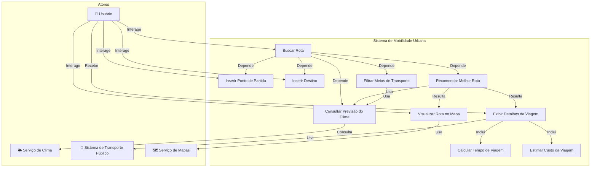
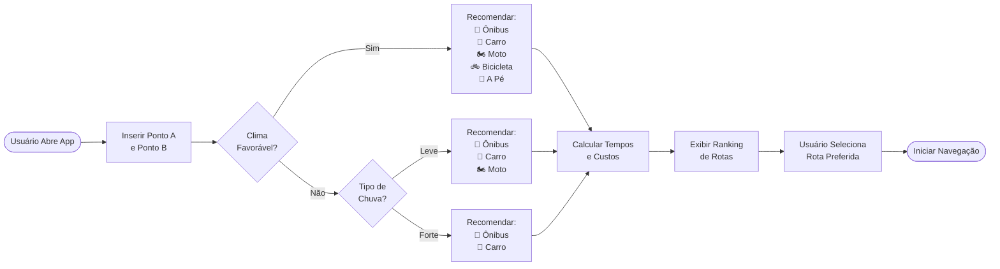
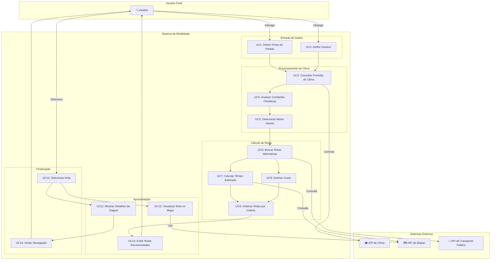
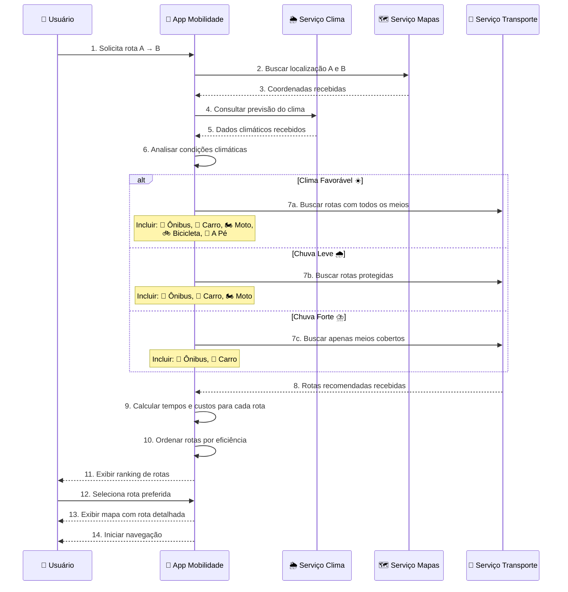
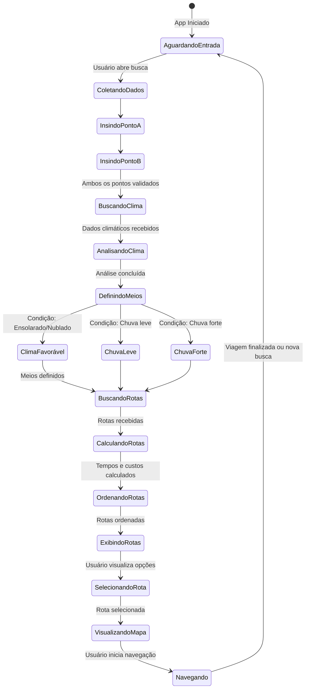
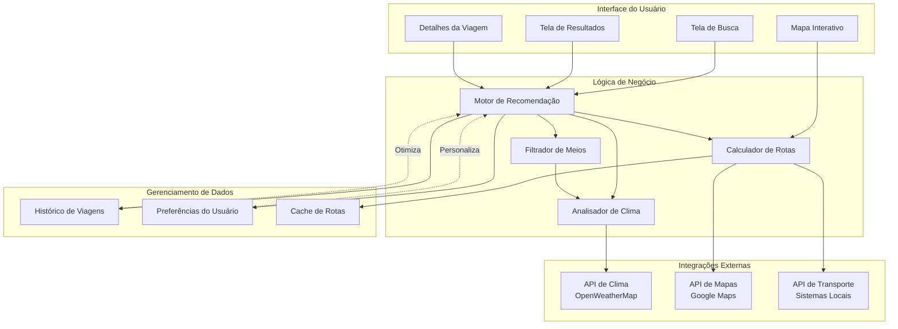
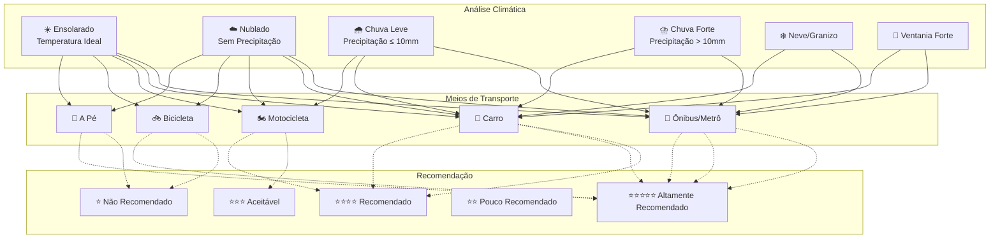

# Diagramas de Caso de Uso - Aplicativo de Mobilidade Urbana Integrada

## 1. Diagrama de Atores e Casos de Uso Principal

## 2. Diagrama de Casos de Uso - Fluxo de Busca de Rota

## 3. Diagrama de Casos de Uso - Detalhado

## 4. Diagrama de Sequência - Busca de Rota

## 5. Diagrama de Estados - Ciclo de Vida da Busca

## 6. Diagrama de Componentes - Arquitetura do Sistema

## 7. Matriz de Recomendação - Meios de Transporte por Clima

## Legenda de Ícones

| Ícone | Significado |
|-------|-------------|
| 👤 | Usuário |
| 🌦️ | Serviço de Clima |
| 🗺️ | Serviço de Mapas |
| 🚌 | Transporte Público/Ônibus |
| 🚗 | Automóvel |
| 🏍️ | Motocicleta |
| 🚲 | Bicicleta |
| 🚶 | A Pé |
| ☀️ | Ensolarado |
| ☁️ | Nublado |
| 🌧️ | Chuva Leve |
| ⛈️ | Chuva Forte |
| ❄️ | Neve/Granizo |
| 💨 | Ventania Forte |

## Resumo dos Casos de Uso

### Atores Principais
1. **Usuário** - Pessoa que busca uma rota de mobilidade
2. **Serviço de Clima** - Fornece previsão meteorológica
3. **Serviço de Mapas** - Fornece informações geográficas
4. **Serviço de Transporte Público** - Fornece dados de transporte

### Casos de Uso Principais
1. **Buscar Rota** - Caso de uso central que coordena todos os outros
2. **Consultar Previsão do Clima** - Obtém dados meteorológicos para filtração
3. **Filtrar Meios de Transporte** - Determina quais meios são viáveis
4. **Recomendar Melhor Rota** - Seleciona as melhores opções baseado em clima e preferências
5. **Visualizar Rota no Mapa** - Exibe a rota graficamente

### Lógica de Filtração por Clima
- **Clima Favorável** (Ensolarado/Nublado): Todos os 5 meios disponíveis
- **Chuva Leve**: 🚌 Ônibus, 🚗 Carro, 🏍️ Moto (sem a pé ou bicicleta)
- **Chuva Forte**: 🚌 Ônibus, 🚗 Carro (apenas meios totalmente cobertos)

### Critérios de Recomendação
1. Viabilidade (baseado no clima)
2. Tempo de deslocamento
3. Custo estimado
4. Conforto
5. Preferências do usuário
